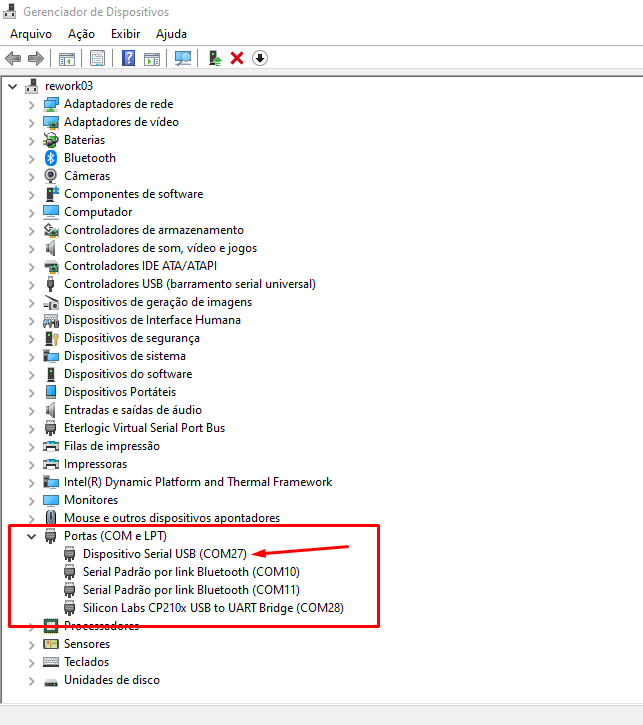
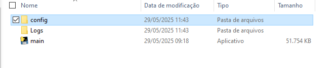
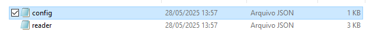
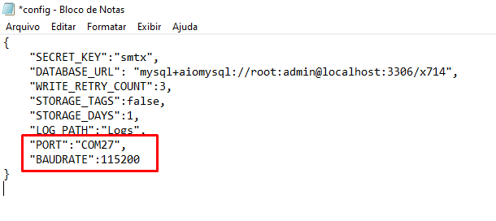
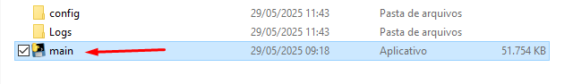
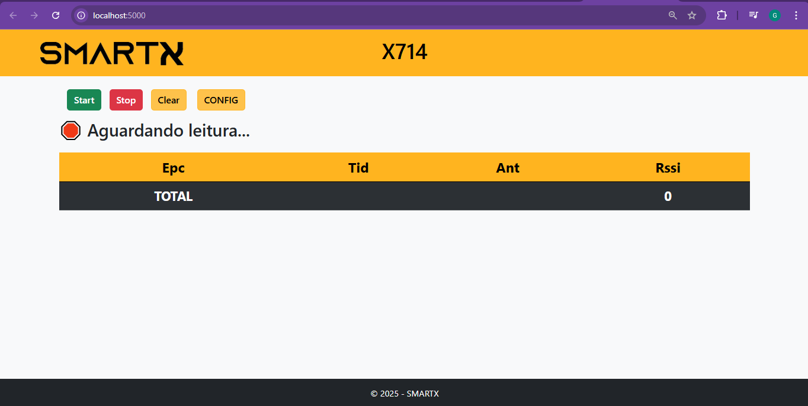
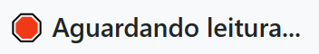
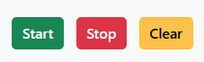
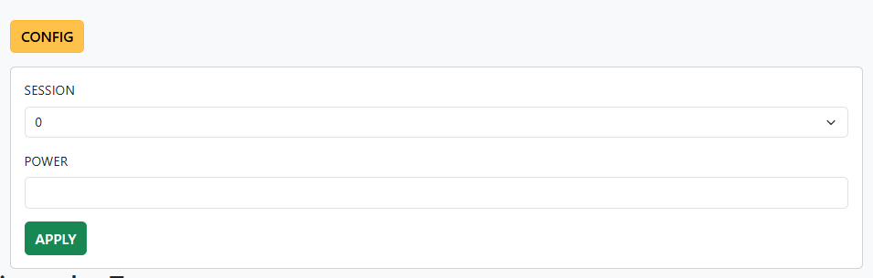
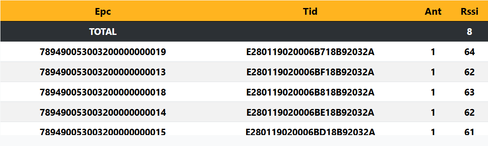

# Manual Software Demonstração X714

## 📘 Introdução
O **X714** é um dispositivo leitor RFID desenvolvido para facilitar a leitura e o gerenciamento de tags RFID de forma simples e eficiente. Este manual descreve o processo de conexão, configuração e operação do dispositivo X714 com o software de demonstração.

---
<div style="page-break-after: always;"></div>

## 🖥️ Conectando o Dispositivo ao Computador
1. Conecte o dispositivo **X714** a uma porta USB no computador.
2. Aguarde até que o sistema operacional reconheça o dispositivo.


## 🛠️ Verificando a Porta COM
1. Abra o **Gerenciador de Dispositivos** no seu computador (Device Manager).


<div style="page-break-after: always;"></div>

2. Expanda a seção **Portas (COM e LPT)**.

3. Localize o dispositivo X714 e anote o número da **porta COM** atribuída (exemplo: COM27).

---
<div style="page-break-after: always;"></div>

## ⚙️ Configurando o Arquivo de Configuração
1. Abra o arquivo `config/config.txt` localizado na pasta do software.


2. Atualize o valor da porta COM de acordo com o número identificado anteriormente.
   ```
   "PORT":"COM27"
   ```


---
<div style="page-break-after: always;"></div>

## ▶️ Executando o Software
1. Localize o arquivo **main** na pasta do software e execute o programa.

2. A interface principal será exibida em uma aba do seu navegador.


---
<div style="page-break-after: always;"></div>

## 🖥️ Interface
### 🔌 Status do Leitor
1. Leitor não conectado, verifique se a configuração da porta COM está correta.


2. Aguardando iniciar leitura.



3. Realizando leitura


### 🔹 Botões:
- **Start**: Inicia o processo de leitura das tags RFID!.
- **Stop**: Interrompe a leitura em andamento.
- **Clear**: Limpa a lista de tags lidas.


- **Config**:
  - **Session**: permite selecionar o número da sessão (0-3).
  - **Power**: permite ajustar a potência de transmissão do leitor (12–30 dBm).


<div style="page-break-after: always;"></div>

### 🖥️ Tabela de Tags:
Mostra o total de tags lidas e os valores de EPC, TID, antena lida e rssi lido de cada tag


---
